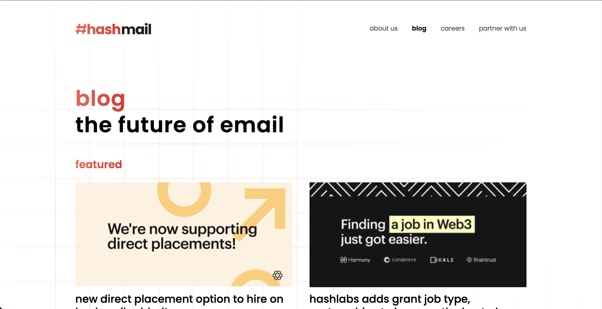
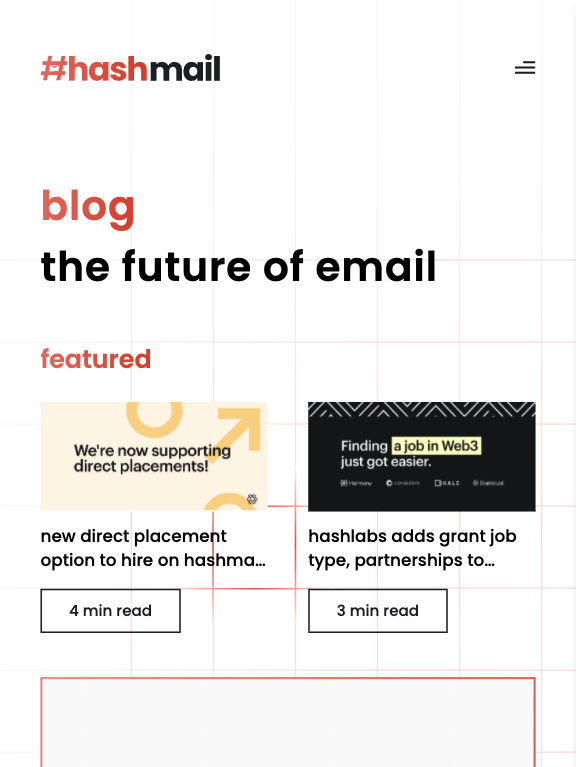
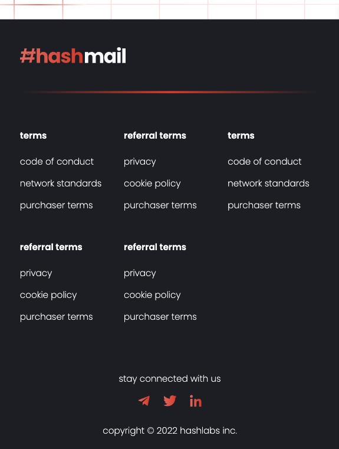
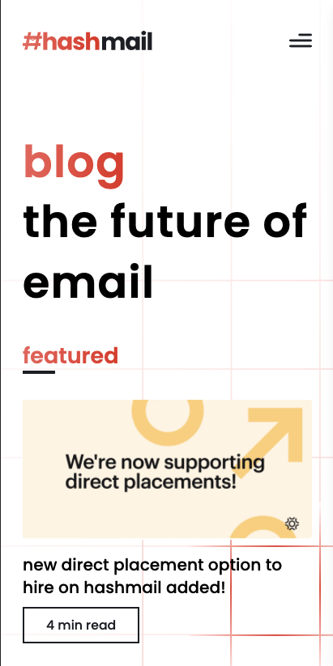
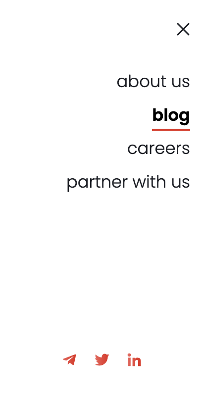
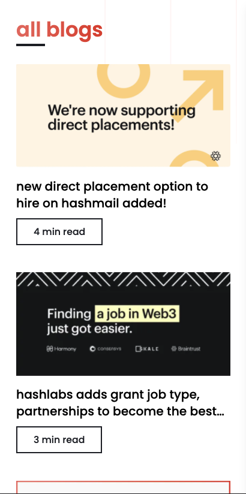
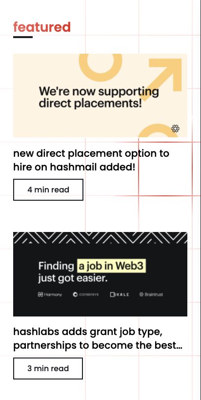
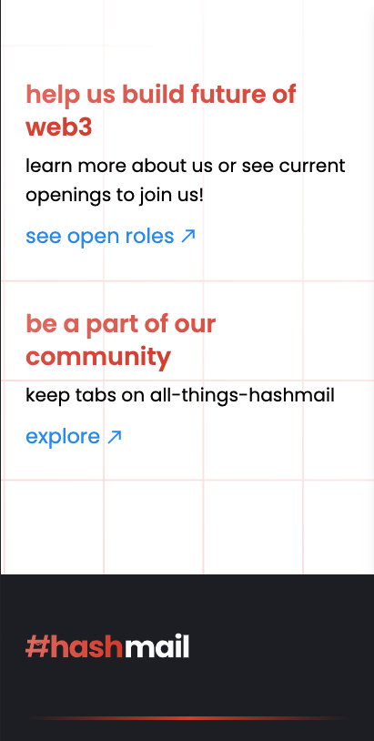
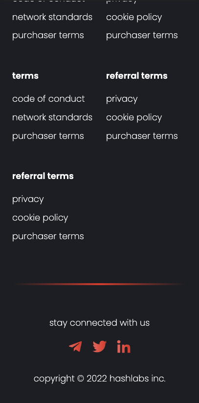

## Getting Started

For running the app locally,

```bash
yarn && yarn dev
```

Open [http://localhost:3000](http://localhost:3000) with your browser to see the result.

<hr>

## Project Description

This Project is a blog landing page using NextJS, Tailwindcss

### Components

- **Layout.js** -> This file consists of basic layout of the website (i.e. Header, Main Content, Footer)

- **Header** -> This consists of two Header

  - Header Mobile
  - Header Desktop

- **Footer** -> This consists of :

  - Footer bottom : Copyright and Socials.
  - Footer Menu : This comprises of all menu sections as a grid.

- **Main content** on landing page is divided into 5 sections :
  - Hero section
  - Featured Blogs section
  - Blogs section
  - Careers section

All custom classes are added in:
`./styles/custom-classes.scss`

All utility functions such as `getBlogPaths`, `getAllBlogs`, `getFeaturedBlogs`, `getBlogData` are added in: `./utils/index.js`

For now, all assets are added in `./public/assets`

Custom 404 has been made with basic layout of `header` and `footer`

**Shared** :

- `GradientBorder` consists of border used in footer.
- `Socials` consists of all socials in footer

<hr>

## Here are some screenshots of the application

### Desktop



### Tablet





### Mobile

<div style="display: flex;justify-content:space-between;margin-bottom:10px;">





</div>

<div style="display: flex;justify-content:space-between;margin-bottom:10px;">





</div>

<div style="display: flex;justify-content:space-between;">





</div>

<hr>

### Difficulties

_Dynamic Grid implementation was tried but was not able to do. `components/NotSoInterestingGrid.js` consist of a grid cursor. This is not a correct implementation for this._

<hr>

<center><b>Thank you!!</b></center>
